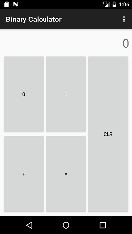

# Java Fundamentals, HW 14 - Java & Android

You are given a work-in-progress binary calculator app. All of the UI has been done but it's missing code!

Here's a screenshot of the app:



The calculator can only work with **binary numbers** and only has one operation: **add**.

Apart from that the calculator works as you would expect - there's a standard text display on the top
showing current input, a `CLR` button that resets the state completely, you can sum two (binary) numbers
and the user can even chain multiple additions by pressing the `+` button instead of `=`.

Hint: No UI changes are necessary, all of the work should be done in `CalculatorActivity`.

## Requirements

* Pressing `0` or `1` must be immediately reflected in the text display


* After pressing `+` the user must be able to input a new number


* Inputting a number, pressing `+`, inputting another number and then pressing `=` must display the (correct) sum


* The user must be able to keep _chaining_ additions with `+`, i.e. the following must work:
  * Input `100`
  * Press `+`
  * Input `10`
  * Press `+` <-- calculator displays 110
  * Input 1
  * Press `+` <-- calculator displays 111
  * Input 1
  * Press `=` <-- calculator displays 1000


* `CLR` completely resets the calculator to the initial state


* Additions with up to 16-digit binary numbers must be supported
* Handling invalid input is completely up to you

## Submitting

For your convenience, we have set up a Gradle task to ZIP up all
files in your project folder so it is easy for you to attach it
to an e-mail and send it our way. All you need to do is to
execute one of the following commands (depending on your OS)
in your project folder:

Linux / OSX:
```
./gradlew clean deploy --console=plain
```

Windows:
```
gradlew clean deploy --console=plain
```

It will ask you for your full name, Student Book Number (also
known as *matrikli number*), homework number and a comment (optional).

Example (OSX):

```bash
$ ./gradlew clean deploy --console=plain
Incremental java compilation is an incubating feature.
:clean
:gatherHwProps

Your full name (e.g. John Smith):
Jane Smith
Your Student Book Number (matrikli number, e.g. B12345):
B12345
Homework number:
14
Comment:
for the lulz
:deploy
Built zip /Users/madis/Code/jf-hw-android-calculator/build/jf-homework-B12345-14.zip

BUILD SUCCESSFUL

Total time: 17.082 secs
```

After Gradle has finished, you can find the generated ZIP file in *build* folder with name such as
*jf-homework-B12345-14.zip* (it contains your Student Book Number/matrikli number and homework number).

Attach the ZIP to an e-mail and **send it our way**, to *jf@zeroturnaround.com*.
